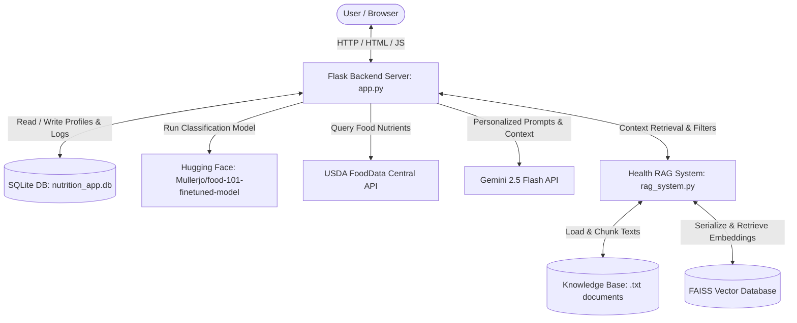

# NutriNova AI: Intelligent Food Analysis & Personalized Nutrition System

NutriNova AI is an advanced, end-to-end web platform designed to analyze dietary choices and offer highly personalized nutrition and wellness advice. Using computer vision for food item identification, database indexing for nutritional details, and Retrieval-Augmented Generation (RAG) for conversational health intelligence, NutriNova AI serves as a comprehensive digital nutritionist.

This project was built as a **Major Academic Project** demonstrating the integration of Deep Learning, Natural Language Processing, and web technologies.

---

## 📸 System Overview & UI Design
NutriNova AI features a modern dashboard equipped with:
*   **Deep-Learning Food Classifier**: Accepts local file uploads or image URLs to identify food categories.
*   **Interactive Calorie Tracker**: Uses user biometric details to calculate custom calorie limits and visualizes consumption progress in real-time.
*   **RAG-Enhanced Health Chatbot**: An expert assistant grounded in verified nutrition facts, implementing automated safety mechanisms and medical search filters.

---

## 🏗️ System Architecture

The following diagram illustrates the workflow and data transitions of NutriNova AI:



---

## 🌟 Key Features

*   **AI Food Recognition**: Powered by a fine-tuned Hugging Face transformer model based on the Food-101 dataset, achieving rapid and reliable image classification across 101 food categories.
*   **USDA Nutrition Fetching**: Cross-references recognized food items with the official USDA database to retrieve detailed macronutrients (protein, carbs, fats, sugars, sodium, fiber, and cholesterol).
*   **Personalized Calorie Dashboard**: Calculates the user's Basal Metabolic Rate (BMR) using the scientifically backed Mifflin-St Jeor Equation and adjusts calorie targets dynamically based on activity levels (sedentary to extra-active) and goals (weight loss, weight gain, muscle building).
*   **Retrieval-Augmented Generation (RAG)**: Integrates semantic search via Sentence Transformers (all-MiniLM-L6-v2) and FAISS vector databases to ground the AI Chatbot's responses with local nutrition guidelines, eliminating hallucinations.
*   **Context-Aware Follow-up**: Remembers recently analyzed food items, allowing users to ask natural follow-up questions (e.g., *"is this portion safe for me?"*) in context.
*   **Medical Safety & Scope Guardrails**: Restricts conversations strictly to wellness and nutrition while filtering out medical diagnostic queries to ensure user safety.

---

## 🛠️ Technology Stack

*   **Backend**: Flask (Python 3.10+), PyTorch, Hugging Face `transformers`, SQLite3, `faiss-cpu`, `sentence-transformers`
*   **Frontend**: Vanilla HTML5, CSS3 (Glassmorphism layout, dynamic canvas particles, responsive grid), Vanilla JavaScript
*   **APIs**: Google Gemini AI API, USDA FoodData Central API

---

## 📦 Prerequisites & Installation

Follow these steps to set up and run the project locally.

### Step 1: Install Python
Ensure that Python 3.10 or higher is installed on your computer. You can check your Python version using:
```bash
python --version
```

### Step 2: Clone the Project Directory
Navigate to the directory containing the project:
```bash
git clone <your-repository-url>
cd NUTRINOVA--
```

### Step 3: Install Required Dependencies
All required libraries are listed in `requirements.txt`. Run the following command to install them:
```bash
pip install -r requirements.txt
```
*Note: Installing PyTorch and transformers may take a few minutes depending on your network connection.*

---

## 🔑 API Key Configuration

NutriNova AI relies on two API integrations. To configure them:

### 1. Google Gemini API Key
*   Visit the [Google AI Studio](https://aistudio.google.com/) and generate a free API key.
*   Open `app.py` and update the `GEMINI_API_KEY` variable on line 193:
    ```python
    GEMINI_API_KEY = "YOUR_GEMINI_API_KEY"
    ```
*   Also update `test_gemini_api.py` on line 7:
    ```python
    GEMINI_API_KEY = "YOUR_GEMINI_API_KEY"
    ```

### 2. USDA FoodData Central API Key
*   Register at the [USDA API Portal](https://api.nal.usda.gov/) to get a free API Key.
*   Open `app.py` and update the `USDA_API_KEY` variable on line 188:
    ```python
    USDA_API_KEY = "YOUR_USDA_API_KEY"
    ```

---

## 🚀 Execution Guide

1.  **Launch the Application**:
    Run the Flask development server:
    ```bash
    python app.py
    ```
2.  **Database & Index Initialization**:
    On startup, the system will automatically:
    *   Initialize the SQLite tables in `nutrition_app.db`.
    *   Chunk the text guidelines located in `nutrition_knowledge/` and compile the FAISS vector database.
3.  **Access the Dashboard**:
    Open your browser and navigate to:
    ```
    http://127.0.0.1:5000
    ```

---

## 📂 Project Structure

```
Major Project/
│
├── app.py                      # Main Flask Backend Server
├── rag_system.py               # RAG Core Engine (FAISS & Embeddings)
├── requirements.txt            # Python Dependencies
├── README.md                   # System Documentation (This file)
│
├── templates/                  # Frontend UI Templates
│   ├── index.html              # Core App Dashboard
│   ├── auth.html               # User Login/Registration Page
│   └── profile.html            # Health Metrics & Goal Config Page
│
├── nutrition_knowledge/        # Source documents for RAG Chatbot
│   ├── balanced_diet.txt
│   ├── hydration.txt
│   ├── post_junk_recovery.txt
│   ├── weight_gain.txt
│   └── weight_loss.txt
│
├── rag_cache/                  # Cached FAISS Indices & Document Pickles
└── test_gemini_api.py          # Gemini API Diagnostic Script
```

---

## ⚖️ License & Disclaimers
This software is built for educational and academic assessment purposes. While the chatbot utilizes state-of-the-art LLMs and RAG architectures, it is not a replacement for professional medical advice, diagnosis, or treatment. Always consult with a qualified health professional regarding clinical conditions.
